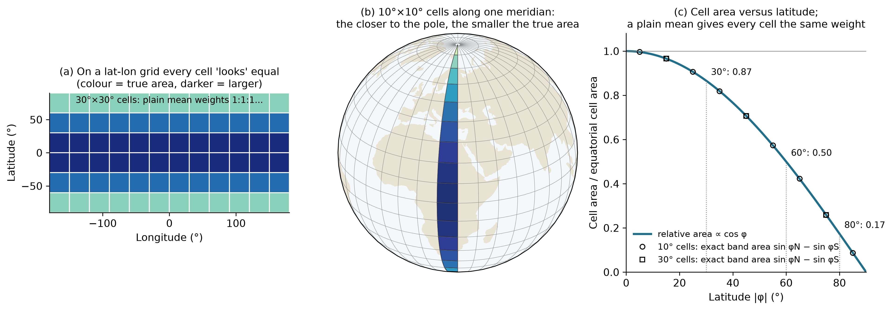
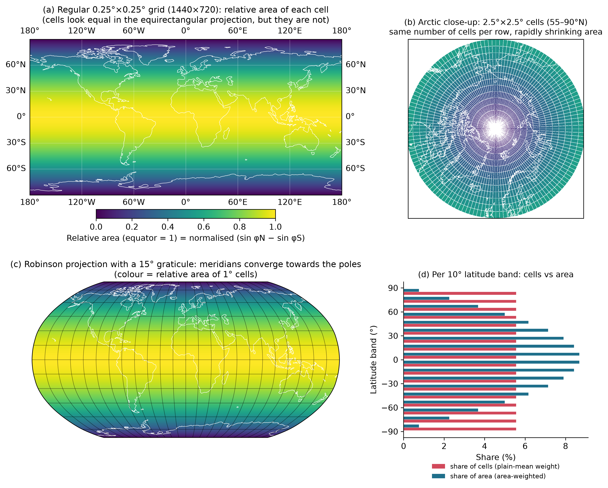

# GeoAreaWeight

[](https://github.com/GISWLH/GeoAreaWeight/actions/workflows/ci.yml)
[](LICENSE)

**Correct area weights and area-weighted statistics for latitude–longitude grids, in Python (NumPy/xarray), R and MATLAB/Octave.**

> Give it the latitudes, get correct area weights and area-weighted means, totals and area fractions.

On a regular latitude–longitude grid (0.25°, 1°, 2.5° …) every latitude row has
the same number of cells, but a cell's area shrinks with cos φ: a cell at 60°N
has half the area of an equatorial cell, one at 80°N only 17 %. A plain
`np.mean`, `nanmean` or `mean(x(:))` gives every cell the same vote and therefore
over-weights the poles. On NCEP/NCAR Reanalysis 1 this makes the 1980–2020 global
mean temperature 4.8 °C instead of 14.2 °C and overstates the warming trend by
75 % ([experiments](docs/EXPERIMENTS.md)).

This mistake contributed to two retractions in *Nature*:

| Paper | Retraction | Role of area weighting |
|---|---|---|
| Pascolini-Campbell et al., *A 10 per cent increase in global land evapotranspiration from 2003 to 2019*, Nature 593, 543–547 (2021), doi:10.1038/s41586-021-03503-5 | 2022-02-24, doi:10.1038/s41586-022-04525-3 | The only reason: global mean precipitation was an **arithmetic mean** instead of a spatially weighted mean, so precipitation and hence evapotranspiration were underestimated. |
| Gebrechorkos et al., *Warming accelerates global drought severity*, Nature 642, 628–635 (2025), doi:10.1038/s41586-025-09047-2 | 2026-09-02, doi:10.1038/s41586-026-11027-z | **One of four reasons**: study-wide averages did not use area-weighted grid cells (the others: GLEAM v3 used instead of GLEAM4, a time-step parsing error, an unclear mask description). |

Details and sources: [docs/LITERATURE.md](docs/LITERATURE.md).



## Installation

**Python** (NumPy required, xarray and dask optional):

```bash
pip install geoareaweight                     # once released on PyPI
pip install "geoareaweight @ git+https://github.com/GISWLH/GeoAreaWeight#subdirectory=python"   # from GitHub
pip install "geoareaweight[xarray]"           # with xarray support
```

**R** (no dependencies):

```r
remotes::install_github("GISWLH/GeoAreaWeight", subdir = "R")
# or from a clone:  R CMD INSTALL R
```

**MATLAB / GNU Octave** (no toolboxes):

```matlab
addpath('path/to/GeoAreaWeight/matlab')   % then: help gaw_area_mean
```

## Quick start

### Python

```python
import numpy as np
import xarray as xr
import geoareaweight as gaw

da = xr.open_dataset("air.mon.mean.nc")["air"]      # (time, lat, lon), any dim order
gmean = gaw.area_mean(da)                           # DataArray(time): exact spherical cell areas
naive = da.mean(("lat", "lon"))                     # WRONG: plain mean over-weights the poles

land  = gaw.area_mean(da, mask=land_mask)           # land-only mean; mask is a boolean (lat, lon) DataArray
total = gaw.area_integral(pr_m_per_yr)              # per-area flux -> total, here m3/yr
dry   = gaw.area_fraction(spei <= -1, valid=spei.notnull())   # drought area fraction (0-1)

# NumPy arrays: pass lat/lon and, if needed, the axis positions
m = gaw.area_mean(x, lat, lon, lat_axis=-2, lon_axis=-1)
w = gaw.area_weights(lat)                           # 1-D weights (sum to 1), from latitudes only
A = gaw.cell_area(lat, lon, units="km2")            # (nlat, nlon) cell areas
```

### R

```r
library(geoareaweight)
# x as read by ncdf4: lon x lat x time
m      <- area_mean(x, lat, lon)                  # defaults lon_dim = 1, lat_dim = 2
m_land <- area_mean(x, lat, lon, mask = land)     # mask: nlat x nlon (nlon x nlat also accepted)
A      <- cell_area(lat, lon, units = "km2")      # nlat x nlon
```

### MATLAB / Octave

```matlab
x   = ncread('air.mon.mean.nc', 'air');          % lon x lat x time
lat = ncread('air.mon.mean.nc', 'lat');
lon = ncread('air.mon.mean.nc', 'lon');
m = gaw_area_mean(x, lat, lon);                  % defaults 'LonDim', 1, 'LatDim', 2
m = gaw_area_mean(x, lat, lon, 'Method', 'cos', 'Mask', landMask);
```

More: [examples/](examples).

## Which function do I need?

| Goal | Python | R | MATLAB / Octave |
|---|---|---|---|
| Mean of an intensive quantity (temperature, precipitation rate, index …) | `area_mean` | `area_mean` | `gaw_area_mean` |
| Mean over a region, land only, ocean only … | `area_mean(..., mask=)` or `region_mean` | `area_mean(mask =)`, `region_mean` | `'Mask'`, `gaw_region_mean` |
| Total of a per-area quantity (water volume, carbon flux, area of a class) | `area_integral` | `area_integral` | `gaw_area_integral` |
| Fraction of the area where a condition holds (drought area, ice cover) | `area_fraction` | `area_fraction` | `gaw_area_fraction` |
| Cell areas in m² or km² | `cell_area` | `cell_area` | `gaw_cell_area` |
| 2-D weight field to use elsewhere | `weights_2d` | `weights_2d` | `gaw_weights_2d` |
| 1-D latitude weights (e.g. for `xarray.DataArray.weighted`) | `area_weights` | `area_weights` | `gaw_area_weights` |
| Model's own cell areas (CMIP `areacella`), or area × land fraction | `weights=` | `weights =` | `'Weights'` |

All statistics keep the other dimensions (time, level, member …), skip missing
values and renormalise the weights over the valid cells at every step.

## Conventions

* **Angles in degrees.** Latitudes must lie in [−90, 90]; a value outside raises
  an error (a common sign of swapped lat/lon).
* **Coordinates are cell centres**, 1-D, ascending or descending, regular or
  irregular. Longitudes may use 0…360 or −180…180 and may cross the wrap point.
  Cell bounds are inferred as mid-points (outer edges clipped to ±90°) unless you
  pass `lat_bounds` / `lon_bounds` as `n+1` edges or as an `(n, 2)` array (the CF
  `*_bnds` layout).
* **2-D fields (weights, areas, masks) are `(nlat, nlon)`.** An `(nlon, nlat)`
  field is transposed automatically when `nlat != nlon`.
* **Data layout.** Python: `lat_axis=-2, lon_axis=-1` for NumPy arrays; for an
  `xarray.DataArray` the coordinates are found automatically (CF
  `standard_name`/`units`, then `lat`/`latitude`/`nav_lat`, `lon`/`longitude`/`nav_lon`,
  then rotated-pole `rlat`/`rlon`), dimension order does not matter, DataArray
  masks/weights are aligned by coordinate labels, and dask arrays stay lazy.
  R and MATLAB: `lon x lat x …` (the `ncdf4` / `ncread` order) by default.
* **Missing data.** NaN (and masked elements of `numpy.ma` arrays) are skipped.
  With `skipna=False` (`'SkipNaN', false`) any missing value inside the domain
  gives NaN. A result is NaN when no valid cell remains.
* **Masks.** `True` / non-zero = include; `False`, 0 and NaN = exclude.

## Weighting methods

| `method` | Weight of a cell | When to use |
|---|---|---|
| `"band"` (default) | exact spherical area ∝ (sin φ_north − sin φ_south) × Δλ | always fine; exact for any lat-lon grid, including coarse, irregular and pole-point grids |
| `"cos"` | cos φ of the cell centre × Δλ | reproduces the textbook formula; error O(Δφ²) on coarse grids; a cell centred on a pole gets weight 0 |
| `"ellipsoid"` | exact WGS84 area via the authalic latitude: R_q² Δλ (sin β_north − sin β_south), R_q = 6 371 007.181 m | totals and areas that must match the WGS84 ellipsoid; global means change by only ~0.05 K |
| `"none"` | 1 | the plain mean, for comparison only |

* NCEP-style grids with rows at ±90° are handled: the pole row becomes a half-height polar cap.
* **Curvilinear grids** (2-D latitude): only cos φ is possible (a warning is
  issued for `"band"`/`"ellipsoid"`); pass the model's cell areas via `weights=`.
  Rotated-pole grids are regular in rotated coordinates, so `rlat`/`rlon` give exact weights.
* **Gaussian grids** (e.g. NCEP T62): mid-point bounds give band weights within
  about 1 % of the Gaussian quadrature weights; regional means are unaffected
  (see experiments). Reduced Gaussian grids (varying number of longitudes per row)
  are not lat-lon grids; use their own cell areas.
* Use `area_mean` for **intensive** quantities (temperature, precipitation rate)
  and `area_integral` for **totals** (precipitation volume, runoff).
* For coastal cells that are only partly land, pass `cell_area × land_fraction` as `weights=`.

## Common pitfalls

* `spei <= -1` is `False` (not NaN) where `spei` is NaN in NumPy/xarray/MATLAB.
  Use `area_fraction(spei <= -1, valid=spei.notnull())` (Python) or
  `'Valid', isfinite(spei)` (MATLAB); otherwise ocean cells count as "no drought".
* `regionmask` masks are NaN outside and the region number inside, and region 0
  would count as "exclude". Pass a boolean, e.g. `mask=(regions == 3)`.
* "Global land mean" depends strongly on whether Antarctica and Greenland are
  included; say which.
* A finer grid does not remove the bias of an unweighted mean (see Fig. 5d).

## Figures and experiments



* [docs/EXPERIMENTS.md](docs/EXPERIMENTS.md): unweighted vs area-weighted means
  and trends on NCEP R1, GISTEMP, GPCP, GPCC, OISST, CRU TS and SPEIbase, plus
  latitude-window, resolution and synthetic experiments (results in `docs/*.json`).
* [docs/LITERATURE.md](docs/LITERATURE.md): fact check of the retractions and
  related literature (with verification status).
* [experiments/](experiments): scripts that produce the results and figures
  (the public datasets must be downloaded first; set `GAW_DATA_DIR`).

## Tests and validation

```bash
# Python (from python/)
pip install -e ".[test]" && pytest           # unit tests + doctests
# R (from the repository root)
R CMD build R && R CMD check geoareaweight_*.tar.gz
# MATLAB / Octave (from the repository root)
octave-cli --eval "addpath('matlab'); addpath('matlab/tests'); test_gaw"
# Cross-language consistency (from validation/)
python ref_python.py ref_python.csv && Rscript ref_r.R ref_r.csv \
  && octave-cli --eval "addpath('../matlab'); ref_octave('ref_octave.csv')" && python compare.py
```

Checks include: global area = 4πR² on the sphere and 510 065 621.7 km² on WGS84;
an independent comparison with the EPSG:6933 equal-area projection (relative
error < 10⁻⁹); agreement with `xarray.DataArray.weighted`; descending, irregular
and wrapped coordinates; NaN renormalisation; masks; axis order; user weights;
dask laziness. The 312 reference numbers in `validation/` agree between Python,
R and Octave to a relative difference of 2 × 10⁻¹⁴.

**The MATLAB code is tested with GNU Octave only, not with MATLAB itself.**

## Repository layout

```
python/        Python package (src/geoareaweight, tests, pyproject.toml)
R/             R package (DESCRIPTION, R/, man/, tests/)
matlab/        MATLAB/Octave functions gaw_*.m (internal helpers in private/), tests/
examples/      short scripts for each language
validation/    cross-language reference values and comparison
experiments/   scripts for docs/ results and figs/
docs/          experiments, literature, result tables (JSON/CSV/Markdown)
figs/          figures
llms.txt       compact API summary for AI assistants
```

## Citation

If you use GeoAreaWeight in published work, please cite it (see
[CITATION.cff](CITATION.cff)) and state how the spatial averages were weighted.

## References

* Pascolini-Campbell M. et al. (2022), Retraction Note, *Nature* 604, 202. doi:10.1038/s41586-022-04525-3
* Gebrechorkos S. H. et al. (2026), Retraction Note, *Nature* 657, 844. doi:10.1038/s41586-026-11027-z
* Wei R., Li Y., Yin J., Ma X. (2022), *Atmosphere* 13(12), 2071. doi:10.3390/atmos13122071
* Ju S.-D., Choi W.-J., Song H.-J. (2024), *AppliedMath* 4(4), 1618–1628. doi:10.3390/appliedmath4040086

## License

MIT © 2026 Longhao Wang
